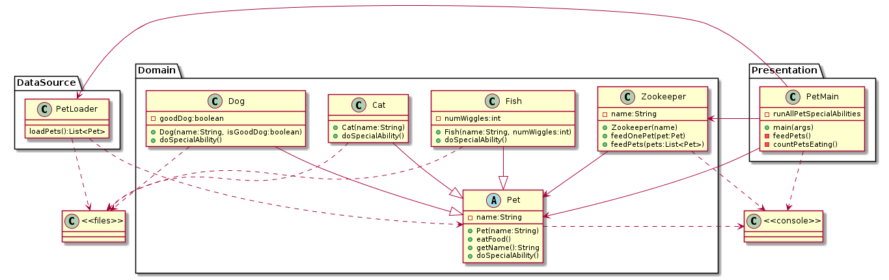
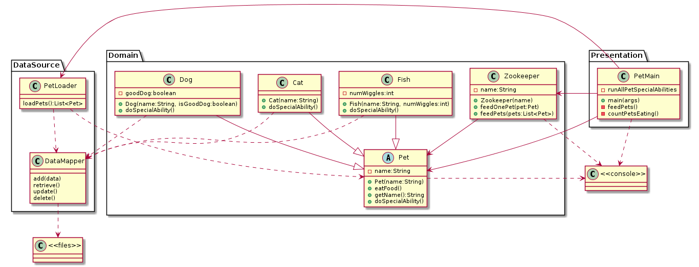
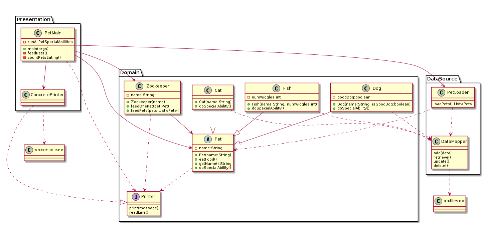
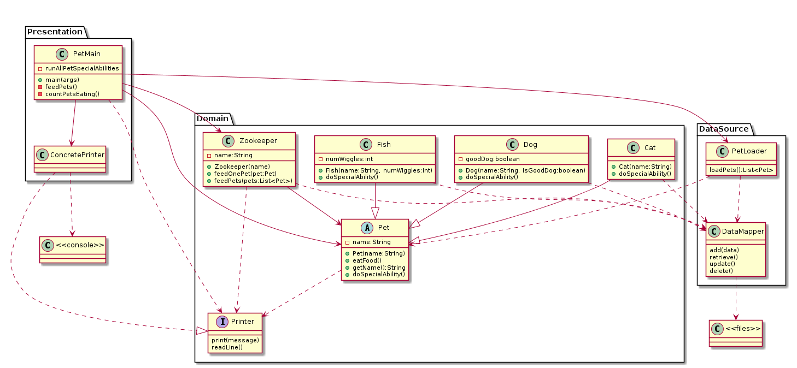
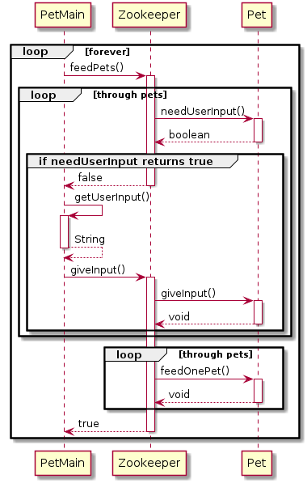
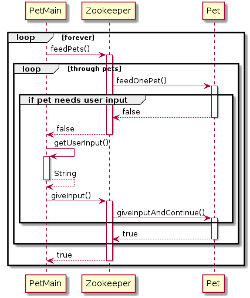

Shiloh Musser
Entry 1
Date: 3/24/2020
Time taken: 10 min

I put PetMain into the presentation layer since it contains the main method which
takes user input. PetLoader was put into the Datasource layer since it appears to
create the pets by loading and reading information from an external file. I 
thought about putting the Zookeeper and Pet classes into the presentation layer
since they interact with the console, but the methods they call appear to be more
about business logic.

Entry 2
Date: 3/24/2020
Time taken: 30 minutes

One way to fix the pet class writing to the console is to add a logger into the
data source layer that they call. The logger would then write to the files
immediately.

The other way to solve this is to have a Data Mapper in the data source layer
that everything uses to interact with files.

Entry 3
Date: 3/25/2020
Time taken: 35 minutes

One solution is for PetMain to pass into the methods it calls some sort of data
structure that gets filled with information that needs to be printed to the
console. This does limit interactivity, and requires for the business logic to
finish before anything can print.

The other solution is to add an interface that the classes call want they want to
print or receive information from the console. The interface would then be
implemented in the presentation layer.

Entry 4
Date: 3/25/2020
Time taken: 5 minutes

I forget to add the dependency from Zookeeper to files in the previous diagrams.
Reusing the DataMapper from before allows Zookeeper to easily call down to the
DataSource and allow for the DataMapper to interact with the files.

Entry 5
Date: 3/27/2020
Time taken: 50 minutes

The first design asks goes through each pet to see if they need input then
returns false to petMain to signify that it needs to retrieve user input.
Afterwards it runs feed all pets.

The second design asks for user input from Main when it encounters a pet that
needs user input. It works similarly to the previous design where the action
returns true or false depending on whether it needs user input to continue.

